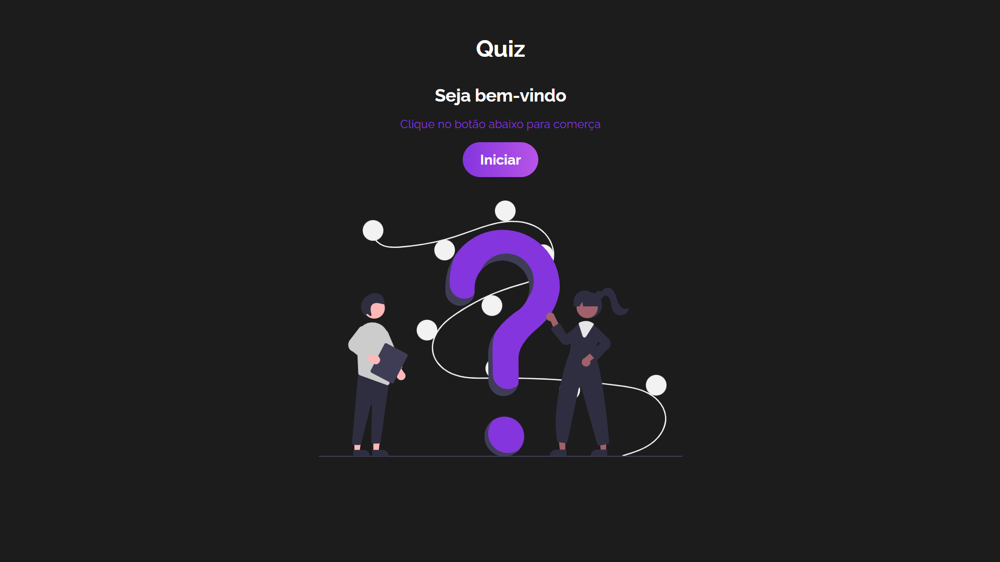
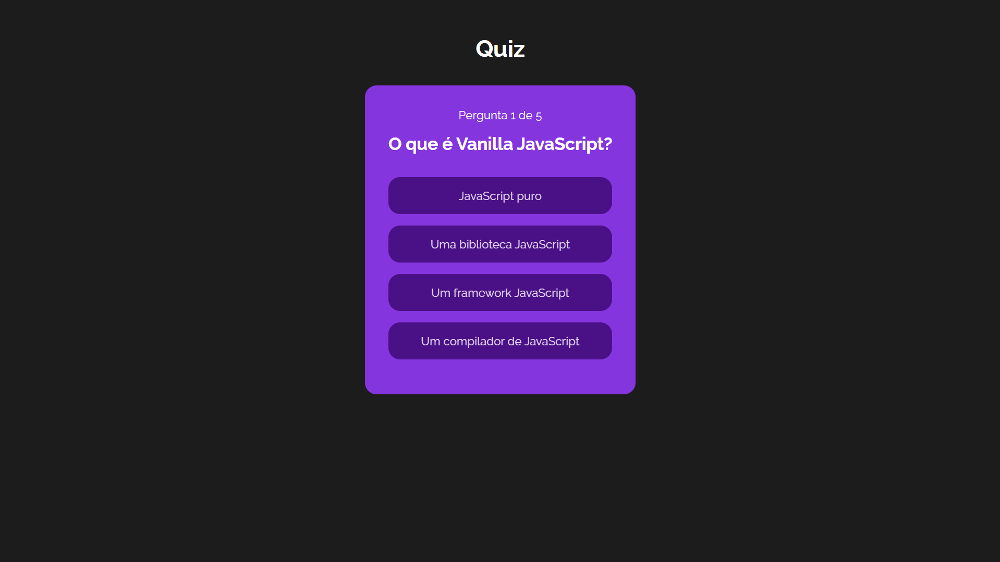
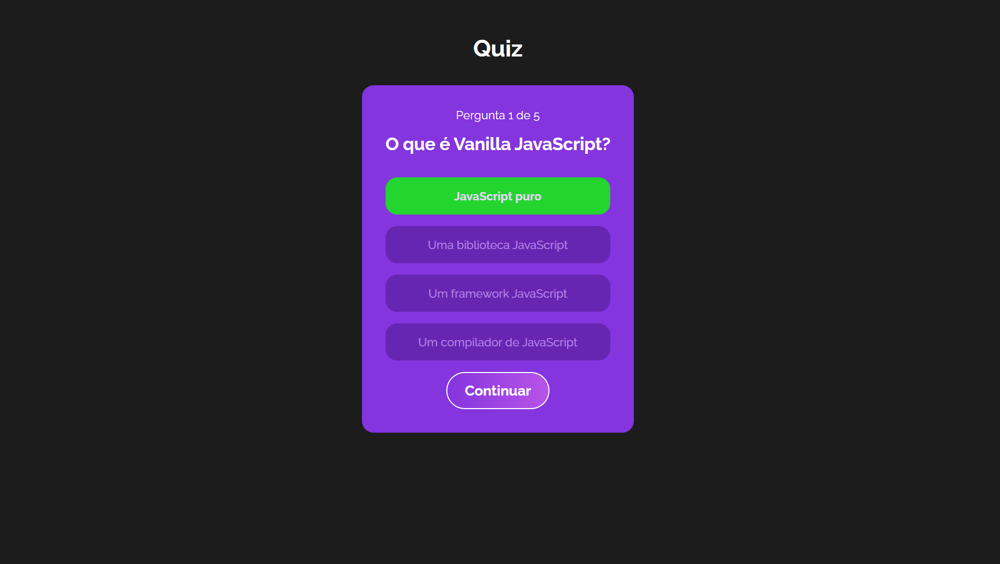
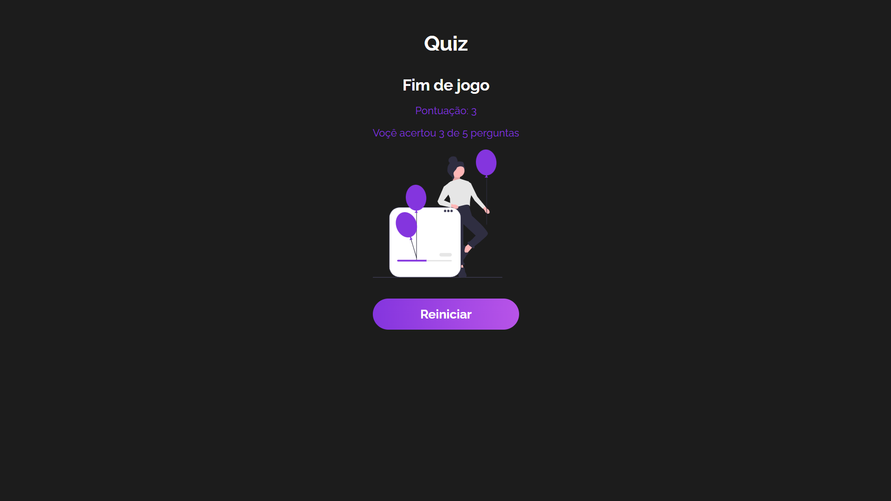

# Quiz de Programação Web Básica

Bem-vindo ao Quiz de Programação Web Básica! Este projeto é um quiz desenvolvido em ReactJS que testa seus conhecimentos sobre conceitos fundamentais de programação web. É uma ótima maneira de praticar e aprender mais sobre HTML, CSS, JavaScript e outros aspectos importantes da criação de páginas web.

Link do projeto: https://react-quiz-programming.vercel.app/

## Como Começar

Para começar, siga estas etapas simples:
Instale as dependências necessárias usando npm:
```bash
npm install
```
Após a instalação das dependências, você pode iniciar o servidor de desenvolvimento:
```bash
npm run dev
```
## Recursos e Tecnologias Utilizadas

Este projeto utiliza uma variedade de recursos e tecnologias para fornecer uma experiência de quiz interativa e educativa. Alguns dos principais incluem:

- **Componentização:** O projeto é dividido em componentes reutilizáveis, facilitando a manutenção e extensão do código.
- **Hooks:** Utilização de hooks do React para gerenciar estado e ciclo de vida dos componentes.
- **Reducer:** Utilização de reducers para gerenciar o estado global da aplicação.
- **Lógica:** Implementação de lógica para verificar respostas, calcular pontuações e determinar o progresso do usuário.
- **Context:** Utilização de contexto do React para compartilhar informações importantes entre componentes.
  




